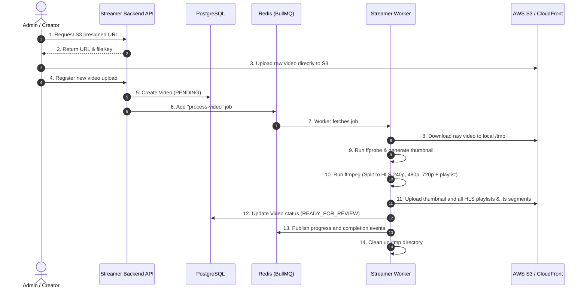
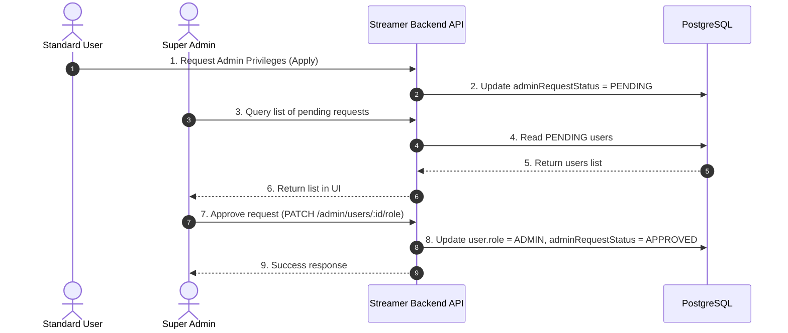

# Complete System Architecture: Streaming Platform

This document describes the complete system architecture of the OTT Streaming Platform monorepo, detailing the physical services, frontend portal roles (User, Admin, and Super Admin), database schemas, security guards, and media pipelines.

---

## 1. High-Level Architecture Map

The platform is designed around a **decoupled, event-driven, three-tier architecture** with Role-Based Access Control (RBAC) separating user-facing, moderation-facing, and system administration actions.

```mermaid
graph TD
    %% Portals (Clients)
    subgraph Frontend Portals (Vite Clients)
        UP[User Portal] -- "Browse & Stream" --> API
        AP[Admin Portal] -- "Upload & Moderate Videos" --> API
        SAP[Super Admin Portal] -- "Manage System & Admins" --> API
    end

    %% API Gateway / Control Plane
    subgraph API & Queues (Render / VPS)
        API[Streamer Backend REST API]
        Redis[Redis Cloud / BullMQ]
    end

    %% Processing Plane (Data Plane)
    subgraph Media Processing
        Worker[Streamer Worker]
        FF[FFmpeg / FFprobe]
    end

    %% Cloud Infrastructure
    subgraph Storage & DB
        PG[(Supabase PostgreSQL)]
        S3[(AWS S3 Bucket)]
        CF[CloudFront CDN]
    end

    %% Interactions
    API -- "Prisma ORM" --> PG
    API -- "Dispatch Transcode Job" --> Redis
    Redis -- "Fetch Job" --> Worker
    Worker -- "Read/Write Client" --> PG
    Worker -- "Execute Commands" --> FF
    Worker -- "Download Raw / Upload HLS" --> S3
    S3 -- "Deliver Segments" --> CF
    CF -- "Stream HLS (m3u8)" --> UP
    API -- "Publish Progress" --> Redis
    Redis -- "WebSocket Updates" --> UP
```

---

## 2. Portal & Role-Based Workflows

The platform supports three logical roles, each mapping to a dedicated client flow or portal layout:

### A. User Portal (Role: `USER`)
* **Purpose**: Facing standard consumer viewers.
* **Core Functions**:
  * Browse categories, search videos, view recommendations.
  * Manage watch history, bookmarks, and watchlist.
  * Stream adaptive HLS videos via CloudFront CDN.
  * Manage billing tier (FREE / PREMIUM).
  * Request upgrade to Admin privileges (creates a `PENDING` request).

### B. Admin Portal (Role: `ADMIN`)
* **Purpose**: Facing content creators, uploaders, and video moderators.
* **Core Functions**:
  * **Video Uploading**: Requests presigned S3 URLs, uploads files, registers raw videos.
  * **Transcoding Status**: Monitors queue progress (via Redis / BullMQ logs).
  * **Video Moderation**: Approves, rejects, or updates uploaded videos before public release.
  * **Category Control**: Manages categories and tags for content organization.

### C. Super Admin Portal (Role: `SUPER_ADMIN`)
* **Purpose**: Facing system operators and platform managers.
* **Core Functions**:
  * **User & Admin Management**: Reviews and approves pending Admin Privilege requests. Upgrades or revokes user roles.
  * **Platform Analytics**: Accesses global stats (total watch time, view counts, user signups, server load).
  * **System Control**: Inspects service health states (database latency, Redis queue status, S3 storage check).

---

## 3. Data Flow Pipelines

### 1. Video Upload and Transcoding Pipeline
The most resource-heavy pipeline in the system is completely asynchronous to ensure backend API responsiveness.



### 2. Admin Privileges Approval Workflow
Standard users can apply for admin privileges, which must be approved by a Super Admin:



---

## 4. Key Deployment Components

To host this multi-portal application, we deploy the following components:

| Component Name | Runtime Environment | Hosting Provider | Deployment Method | Scaling Strategy |
| :--- | :--- | :--- | :--- | :--- |
| **User Portal** | Static SPA (React/Vite) | Netlify / Vercel / Render Static | Github CD | Global Edge CDN |
| **Admin Portal** | Static SPA (React/Vite) | Netlify / Vercel / Render Static | Github CD | Global Edge CDN |
| **Super Admin Portal**| Static SPA (React/Vite) | Netlify / Vercel / Render Static | Github CD | Global Edge CDN |
| **Backend API** | Node.js (NestJS) | Render (Web Service) | Dockerfile.backend | Horizontal Auto-scaling |
| **Background Worker** | Node.js + FFmpeg | Render (Background Worker) | Dockerfile.worker | Queue Length / CPU Metric |
| **PostgreSQL Database** | PostgreSQL | Supabase | Managed Cloud DB | Read Replicas (for scale) |
| **Cache & Message Queue**| Redis | Redis Labs Cloud | Managed Cloud Cache | High Availability Cluster |
| **Object Storage** | Object Store | AWS S3 | S3 bucket | Bucket replica (optional) |
| **Media Delivery** | CDN | AWS CloudFront | CloudFront Distribution | Global Edge Cache |
